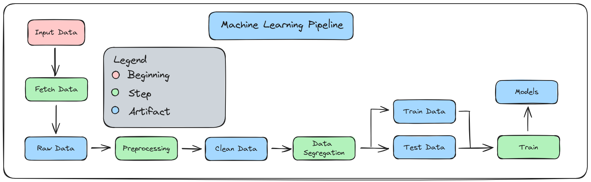

# IMD0188 - MACHINE LEARNING

## Identification & Affiliation

Jefferson dos Santos Leocadio and Yuri Iohanssen Ribeiro Damasceno are currently pursuing a postgraduate degree in Information Technology at the Federal University of Rio Grande do Norte (UFRN). As part of their academic journey, they enrolled in the course "Machine Learning"[IMD0188] taught by Professor Daniel Sabino.

## Introduction

Introduction to Machine Learning. Data Classification: classification problems; classification algorithms; classification validation; classifier committees. Notions of cluster analysis and multi-label learning. Applications.

# Final Project

## Introduction

The Regional Electoral Court of Rio Grande do Norte (TRE-RN) uses the GLPI ("Gestionnaire Libre de Parc Informatique") system to manage its IT assets, problem tracking and service center. Currently, there is a department that analyzes all support tickets and classifies them, if this has not been done by the user, so that they can reach the responsible location. Failure to classify them leads to a longer wait time, resulting in a customer who is unable to actively perform their activity.

This project consists of using classification models to optimize the efficiency of the triage sector and ensure faster service to the end customer. A pipeline was developed to classify the tickets descriptions by the customer. The dataset consists of approximately 65 thousand tickets.

## Pipeline

The developed pipeline consists of four steps in total, where a green box represents a step taken on a script, and a blue box represents the output artifact of that step.

## Fetch Data

The first step involves acquiring data from the source. In this case, we use a database dump that contains GLPI data and recreate the database using a MariaDB Docker container. Then, we extract the relevant columns needed for labelling the tickets and its their description and save on a CSV file.

## Preprocessing

This step also takes the CSV file as input and is responsible for cleaning the data. In this case, all text is converted to lowercase, punctuation and stopwords are removed, and finally, word tokenization is performed.